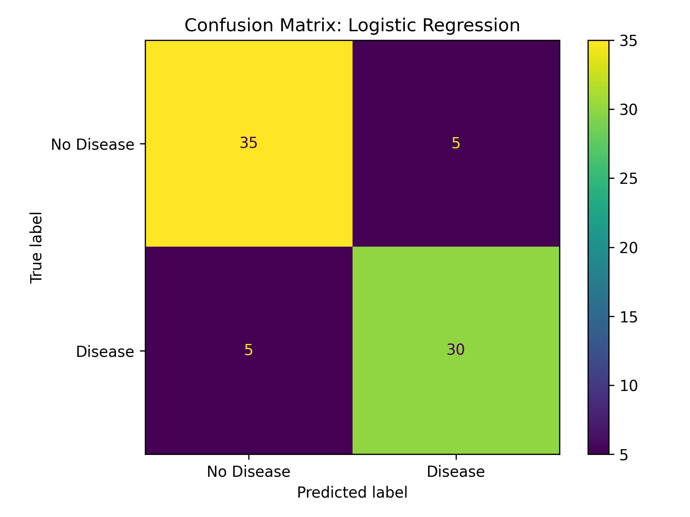

# TrustworthyML

## Evaluating Reliability, Calibration, and Confidence in Machine Learning Predictions

TrustworthyML explores machine learning evaluation beyond standard accuracy metrics by analyzing model calibration, confidence behavior, and disagreement patterns in clinical prediction systems.

The project focuses on understanding whether model predictions are not only accurate, but also reliable and trustworthy enough for real-world decision-support settings.

---

## Overview

This project implements an end-to-end trustworthy machine learning workflow using classification models trained on clinical risk prediction data.

The analysis emphasizes:

- Model calibration
- Confidence reliability
- High-confidence error analysis
- Heuristic disagreement detection
- Transparent model comparison

---

## Key Results

### Calibration Analysis

Calibration curves were used to evaluate whether predicted probabilities aligned with observed outcomes.


---

### Confidence Distribution

The project analyzes confidence distributions for correct and incorrect predictions to identify potentially unsafe overconfident model behavior.


---

### Confusion Matrix

Confusion matrices were used to evaluate classification behavior and identify false positive and false negative patterns.



---

## Trustworthy AI Analysis

Beyond traditional performance metrics, the project investigates:

- Expected Calibration Error (ECE)
- High-confidence incorrect predictions
- Model vs heuristic disagreement cases
- Reliability of predicted probabilities
- Clinical decision-support implications

---

## Example Insights

- Accuracy and ROC-AUC alone are insufficient for evaluating trustworthy AI systems.
- Calibration analysis helps determine whether predicted probabilities reflect true outcome likelihoods.
- High-confidence errors are particularly important in healthcare applications because they may lead to unsafe trust in model predictions.
- Disagreement between ML predictions and simple heuristics can identify clinically ambiguous cases requiring additional review.

---

## Project Structure

```text
trustworthyML/
├── Notebook/
├── figures/
├── src/
├── requirements.txt
├── LICENSE.txt
└── README.md
```

---

## Tech Stack

- Python
- scikit-learn
- XGBoost
- pandas
- matplotlib
- Jupyter Notebook

---

## Models Evaluated

- Logistic Regression
- XGBoost

---

## Features

- End-to-end ML workflow
- Calibration curve analysis
- Confidence reliability analysis
- Heuristic disagreement evaluation
- Feature preprocessing pipeline
- Model comparison and evaluation

---

## Future Work

- SHAP interpretability analysis
- Fairness and subgroup evaluation
- Uncertainty estimation methods
- Model cards and reporting
- Interactive Streamlit dashboard

---

## Why This Project Matters

In high-impact domains such as healthcare, machine learning systems must be evaluated not only for predictive performance, but also for reliability, transparency, and calibration.

This project demonstrates a practical workflow for assessing whether model predictions can be trusted in real-world decision-support scenarios.

---

## License

This project is licensed under the MIT License.
