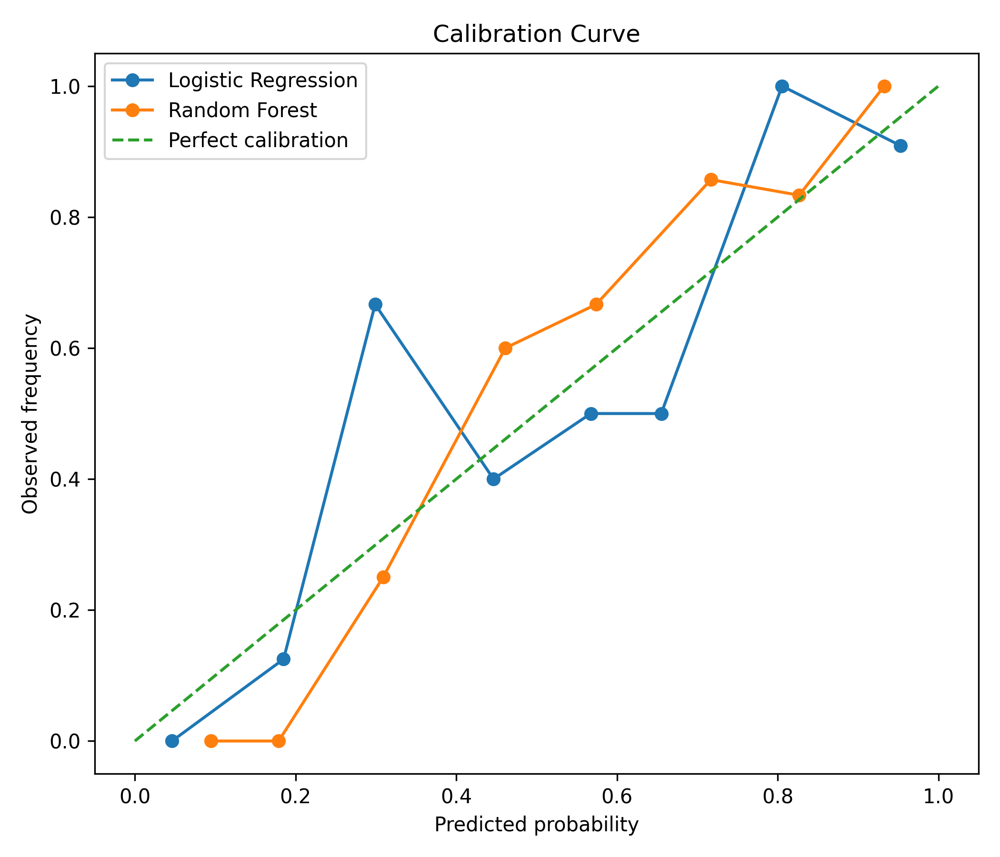

# TrustworthyML

Short one-line description

## Overview

Short paragraph.

---

## Key Results

### ROC Curve

### Calibration Analysis

### Feature Importance

---

## Model Comparison

| Model | Accuracy | AUC |
|---|---|---|
| Logistic Regression | 0.xx | 0.xx |
| XGBoost | 0.xx | 0.xx |

---

## Tech Stack

---

## Run Locally
